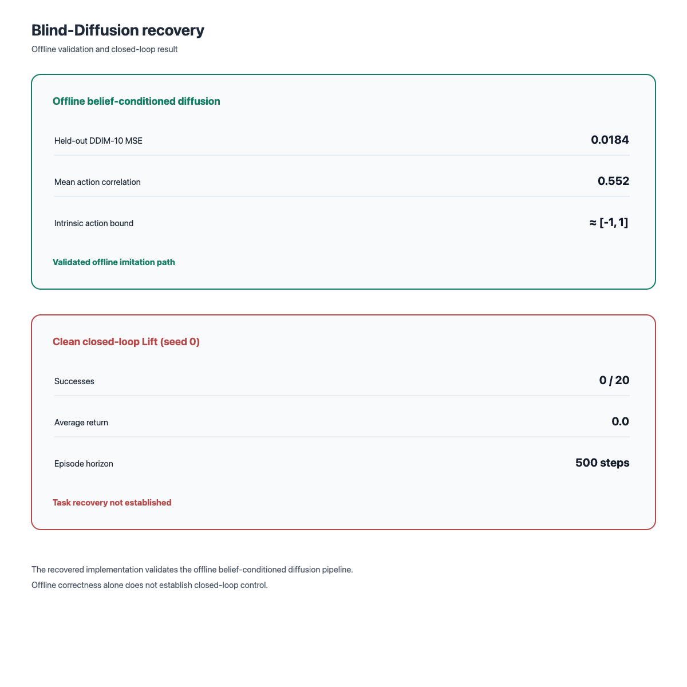

# Blind-Diffusion

Blind-Diffusion is a research implementation of belief-conditioned diffusion
control for robotic manipulation under partial observation. An RSSM turns an
observation/action history into a recurrent belief state; a diffusion policy
then generates a short action sequence conditioned on that belief. The project
is a compact reference for keeping world-model training, action timing, and
receding-horizon control on one causal convention.



## Highlights

- Causal recurrent RSSM beliefs: `belief[t] = posterior(obs[t], action[t-1])`.
- Bounded direct-`x0` diffusion policy for native low-dimensional actions.
- DDIM and DDPM action-sequence sampling for receding-horizon control.
- RoboMimic / RoboSuite integration with dataset controller metadata preserved.
- Offline correctness is validated; the current closed-loop Lift limitation is characterized below.

## Results

The recovered implementation validates the offline belief-conditioned diffusion
pipeline on a demonstration-disjoint Lift evaluation:

| Evaluation | Result |
| --- | ---: |
| Held-out DDIM-10 imitation MSE | 0.0184 |
| Held-out mean action correlation | 0.552 |
| Action range | intrinsically bounded to approximately `[-1, 1]` |
| Clean Lift closed-loop success (seed 0) | 0 / 20 |
| Clean Lift average return (seed 0) | 0.0 |

DDPM sampling is also numerically stable in the corrected path. Crucially,
offline imitation does **not** translate into successful closed-loop Lift
control in the current reproduction: all 20 seed-0 evaluation episodes ran to
the 500-step horizon without a success.

## Closed-loop failure analysis

Our diagnostics identify policy-induced observation distribution shift and
recurrent latent drift as the dominant observed failure mode in the tested setting:

```text
policy deviation
  → observation distribution shift
  → encoder / RSSM posterior-mean drift
  → latent state leaves the expert distribution
  → policy receives unfamiliar conditioning
```


Across two recorded closed-loop traces, the sampled latent norm reached
`||z||₂ ≈ 71.75`, compared with a teacher-forced demonstration reference
maximum of `≈ 11.19`. Simple adaptation methods improved this excursion only
by trading away expert-representation quality; a safe deployable remedy has
not yet been established. The recovered implementation therefore validates the
offline belief-conditioned diffusion pipeline, but clean closed-loop Lift
performance remains unsuccessful in our current reproduction.

## What was corrected

- Safe lazy RoboMimic HDF5 lifecycle for dataset construction and workers.
- Persistent causal RSSM state propagation and pre-action temporal alignment.
- A reusable RSSM one-step prior transition.
- Direct-`x0` diffusion with an intrinsic `tanh` action bound.
- Matching DDIM/DDPM production sampling equations and focused sampler tests.
- Preservation of the dataset's 7-D `OSC_POSE` controller configuration during evaluation.

## Current status

The repository is executable and its offline diffusion/imitation behavior is
validated. It is **not** an end-to-end successful Lift controller. Future work
will likely require recovery supervision or another robustness mechanism for
policy-induced out-of-distribution states, rather than further changes to the
offline diffusion objective alone.

## Quick start

Python 3.10+ and PyTorch are required. Install the package with the RoboMimic
extras in a clean environment:

```bash
python -m venv .venv
source .venv/bin/activate
pip install -e ".[robomimic]"
export PYTHONPATH="$PWD/src"
```

Download the RoboMimic low-dimensional dataset and point `ROBO_DATA` to its
parent directory:

```bash
python -m robomimic.scripts.download_datasets \
  --tasks lift --dataset_types ph --hdf5_types low_dim \
  --download_dir ./robomimic_datasets
export ROBO_DATA="$PWD/robomimic_datasets"
```

Run the focused regression tests:

```bash
python -m unittest discover -s tests
```

Then train a low-dimensional world model, train the diffusion policy, and
evaluate with receding-horizon control:

```bash
python scripts/train_wm.py task=lift
python scripts/train_diffusion.py task=lift
python scripts/eval_diffusion.py task=lift eval.mode=rhc
```

The default Hydra configs live in `src/blind_diffusion/configs/`.

## Repository layout

```text
src/blind_diffusion/  models, data, training, evaluation, and configs
scripts/              public training and evaluation entrypoints
tests/                focused regression tests
assets/               public result figures
```

## License

MIT. See [LICENSE](LICENSE).
