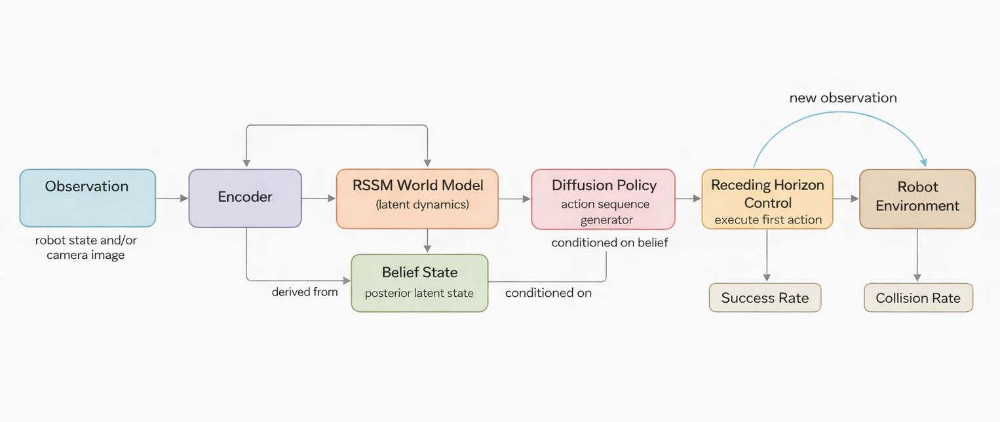

# 🕶️ Blind Diffusion (BD)
<p align="center">
  
</p>


> **World models meet diffusion control.**  
> Tiny RSSM + MPC + Diffusion for RoboMimic manipulation.

[](LICENSE)


---

## ✨ What is Blind Diffusion?

**Blind Diffusion** explores a simple but powerful idea:

> Learn a **latent world model**, generate **action plans** with diffusion,  
> and execute them using **receding-horizon control**.

This repo implements a minimal research-friendly pipeline for robotic manipulation:

🧠 RSSM world model  
🎯 MPC planning in latent space  
🌫 Diffusion action sequence generation  
👁 Image-based perception (Milestone 3)

Designed to be:

- 🔬 research-oriented  
- 🧩 modular & extensible  
- ⚡ runnable on a single GPU  
- 🤖 aligned with modern model-based robotics  

---

## 🚀 Milestone Overview

### 🥇 Milestone 1 — Latent World Model + MPC
Train a small RSSM world model on RoboMimic low-dimensional observations and run receding-horizon MPC in latent space.

Outputs:
- success rate
- collision / constraint violations
- open-loop baseline comparison

---

### 🥈 Milestone 2 — Diffusion Policy
Train a diffusion model to generate action sequences conditioned on RSSM belief state.

- diffusion open-loop baseline
- diffusion + receding horizon control

---

### 🥉 Milestone 3 — Vision-Based Control
Extend to image observations with a CNN encoder.

- image-conditioned RSSM
- diffusion planning from vision
- contact / collision metrics

---

## 🐳 Docker (Recommended)
Build image (includes system deps, MuJoCo 2.1.0, uv, robomimic):
```bash
docker build -t blind-diffusion:latest .
```
Run container:
```bash
docker run --rm -it \
  -v $PWD:/workspace \
  -w /workspace \
  blind-diffusion:latest
```
If you want to use local datasets:
```bash
docker run --rm -it \
  -v $PWD:/workspace \
  -v /path/to/robomimic_datasets:/data \
  -e ROBO_DATA=/data \
  -w /workspace \
  blind-diffusion:latest
```
---

## ⚡ Quickstart (Local)
```bash
uv venv
source .venv/bin/activate
uv pip install -e .
export PYTHONPATH=./src
```
If you need RoboMimic env evaluation on Linux (installs this repo + robomimic):
```bash
uv pip install -e ".[robomimic]"
```
You also might need mujoco_py installed
---

## 📦 RoboMimic Data Setup
This section applies to both local and Docker runs. For Docker, mount your dataset folder and set `ROBO_DATA=/data` (see Docker section).

1. Install RoboMimic and dependencies.
2. Download low-dim datasets (default: `lift/low_dim_v141.hdf5`):
`https://robomimic.github.io/docs/datasets/overview.html`
`https://robomimic.github.io/docs/datasets/datasets.html`
`https://robomimic.github.io/docs/datasets/robomimic_datasets.html`
3. Set dataset path:
```bash
export ROBO_DATA=/path/to/robomimic/datasets
```
Example download:
```bash
mkdir -p ./robomimic_datasets
cd ./robomimic_datasets
curl -L -o lift_low_dim.hdf5 "<direct_dataset_link>"
export ROBO_DATA=./robomimic_datasets
```
RoboMimic downloader (after installing robomimic):
```bash
python -m robomimic.scripts.download_datasets --task lift --dataset_type low_dim --version v141 --download_dir ./robomimic_datasets
export ROBO_DATA=./robomimic_datasets
```
---

## ✅ Run Order (Minimal)
1. Train world model (low-dim):
```bash
uv run python scripts/train_wm.py --config configs/train_world_model.yaml task=lift
```
2. Evaluate MPC:
```bash
uv run python scripts/eval_mpc.py --config configs/eval_mpc.yaml task=lift
```
3. Train diffusion (Milestone 2):
```bash
uv run python scripts/train_diffusion.py --config configs/train_diffusion.yaml task=lift
```
4. Evaluate diffusion (RHC):
```bash
uv run python scripts/eval_diffusion.py --config configs/eval_diffusion.yaml task=lift
```
---

## 🧪 Optional Baselines
BC (low-dim):
```bash
uv run python scripts/eval_open_loop.py --config configs/eval_mpc.yaml task=lift eval.mode=bc_train
uv run python scripts/eval_open_loop.py --config configs/eval_mpc.yaml task=lift eval.mode=bc_eval
```
Diffusion open-loop:
```bash
uv run python scripts/eval_diffusion.py --config configs/eval_diffusion.yaml task=lift eval.mode=open_loop
```
Image BC:
```bash
uv run python scripts/train_bc_image.py --config configs/train_bc_image.yaml task=lift
uv run python scripts/eval_image_policy.py --config configs/eval_image.yaml task=lift eval.mode=bc_eval
```
---

## 👁 Milestone 3 (Images)
1. Train image world model:
```bash
uv run python scripts/train_wm_image.py --config configs/train_world_model_image.yaml task=lift
```
2. Train image diffusion:
```bash
uv run python scripts/train_diffusion_image.py --config configs/train_diffusion_image.yaml task=lift
```
3. Evaluate image diffusion (RHC):
```bash
uv run python scripts/eval_image_policy.py --config configs/eval_image.yaml task=lift
```
Open-loop image diffusion:
```bash
uv run python scripts/eval_image_policy.py --config configs/eval_image.yaml task=lift eval.mode=open_loop
```
---

## 📁 Project Layout
```
configs/ — experiment & model configs  
scripts/ — CLI entry points  
src/blind_diffusion/ — core library  
runs/ — outputs & checkpoints  
```
---

## 🧩 Design Notes

- Milestone 1 uses low-dim observations only  
- Collision / constraint violation defined in:
`
src/blind_diffusion/planner/cost.py
`
---

## 🎯 Why this project?

Modern robot learning is converging toward:

✔ world models  
✔ generative planning  
✔ receding horizon control  

This repo is a minimal playground for exploring that convergence.

---

## 🛣 Roadmap

- cross-attention planning  
- latent diffusion planning  
- multi-task RoboMimic  
- real robot transfer  
- uncertainty-aware planning  

---

## 📜 License

MIT License — see LICENSE.

---

⭐ If you find this useful, give it a star and experiment freely.
